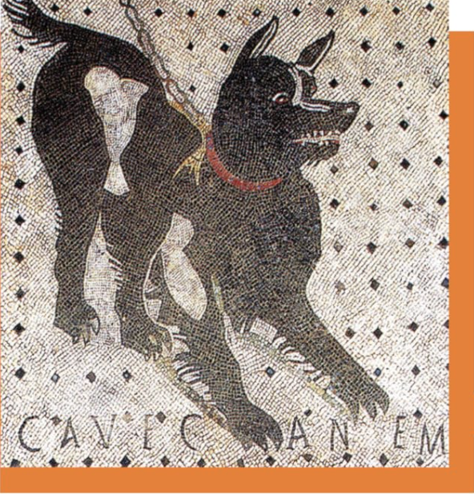

# Lingua Latina — Pars I

Personal study notes and solutions created while working through *[Lingua Latina per se Illustrata - FAMILIA ROMANA](https://www.culturaclasica.com/lingualatina/index.htm)* by [Hans H. Ørberg](https://en.wikipedia.org/wiki/Hans_%C3%98rberg) (Cultura Clásica).

*FAMILIA ROMANA*, the first part of Lingua Latina per se Illustrata, is the foundation of an introductory Latin course designed by Hans H. Ørberg for self-study. It covers the essential rules of Latin grammar while gradually introducing a basic vocabulary of approximately 1,500 words.

The notes included in this repository are also based on the **Manual del Alumno** (Spanish student guide), which I use as a companion to the main text.

!!! warning "Copyright"
    This site contains **only personal notes and self-written answers or solutions to the exercises** provided in the book. It does not reproduce or redistribute any original text or exercises from *Lingua Latina per se Illustrata - FAMILIA ROMANA*.

  

## About the book

*FAMILIA ROMANA* comprises **35 chapters** (XXXV CAPITVLA), each a graded Latin narrative about a Roman family in the 2nd century AD. Grammar and vocabulary are acquired inductively through repeated exposure in context.

## Personal notes

For each chapter (CAPITVLVM) of the book, the following files are included:

| File | Content |
|------|---------|
| `compendium.md` | Chapter summary |
| `grammatica.md` | Grammar notes |
| `vocabulum.md` | New vocabulary |
| `exercitia/pensvm_*.md` | Exercise solutions |

Chapter folders are located under `docs/chapters/cap-01/` … `docs/chapters/cap-35/`.

These notes are intended as a place to store my own work and progress while studying the book.

## Progress

See **[Progress](progress.md)** for completion status across all chapters.

